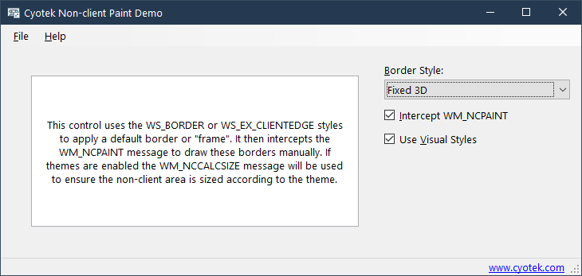

# Painting the borders of a custom control using WM_NCPAINT

This repository contains a C# WinForms sample application that
demonstrates using the `WS_BORDER` and `WS_EX_CLIENTEDGE` styles
to apply an automatic border, but that also intercepts the
`WM_NCPAINT` and `WM_NCCALCSIZE` messages in order to custom
paint those borders.

For more information, please see the following article on the
Cyotek blog:

* [Painting the borders of a custom control using WM_NCPAINT](https://www.cyotek.com/blog/painting-the-borders-of-a-custom-control-using-wm-ncpaint)
